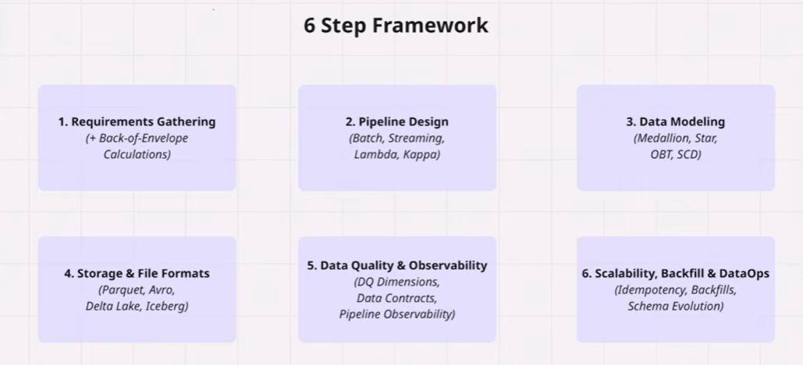
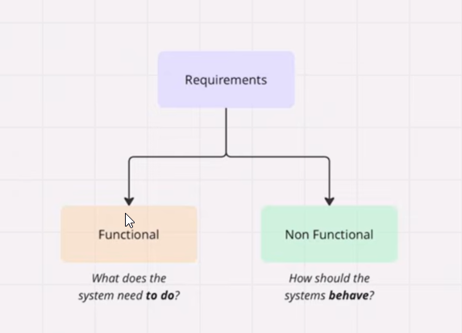
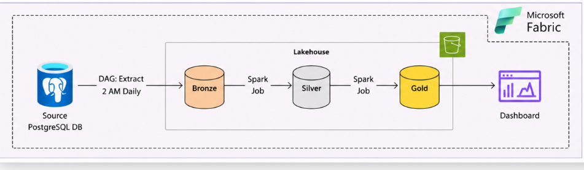
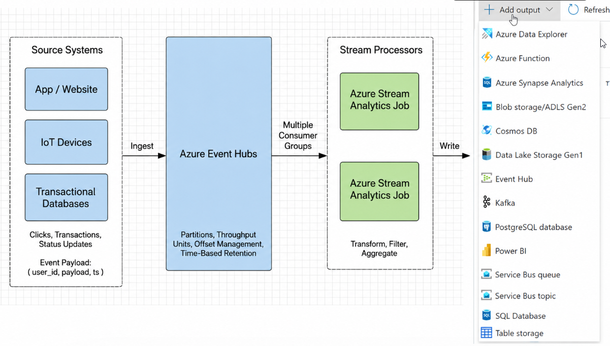
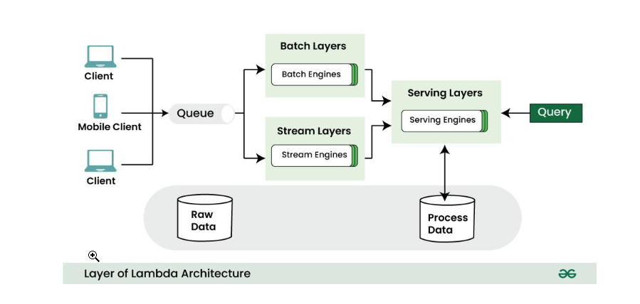
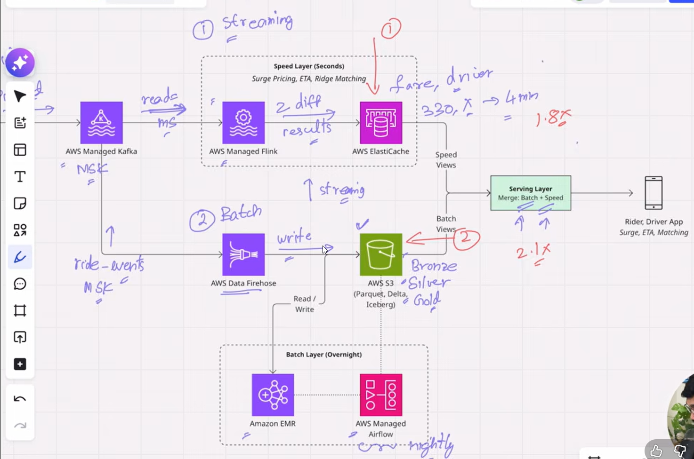
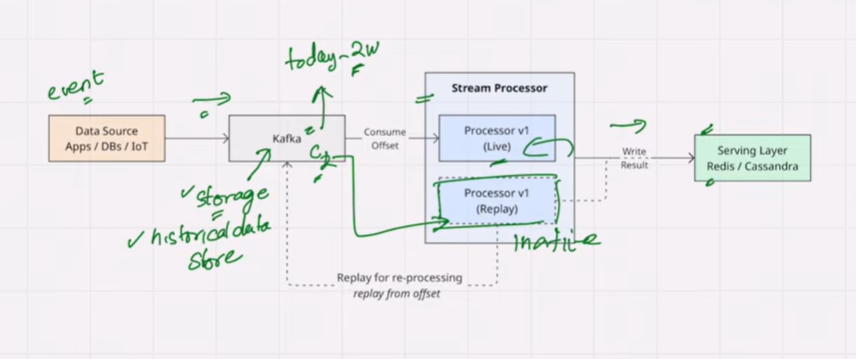

# Data Engineering System Design

> System design, unlike coding questions, is open-ended. There's no *single* correct answer — if you ask 10 senior engineers to design the same ingestion pipeline, you'll get 10 valid architectures, each optimizing different trade-offs: cost, latency, complexity, or failure handling. There's no universally optimal solution; optimality depends on the constraints. That's why justifying your choices and explaining trade-offs matters most.
>
> For example — ingestion patterns, data modeling, batch vs. streaming, schema evolution, idempotency, backfills, cost, and scale. Different topics, but the same way of thinking.
>
> And that's the whole point: every data engineering system design problem — a lakehouse for e-commerce, a recommendation pipeline, a fraud detection system, or a customer 360 platform — breaks down using the **same single framework**.
>
> And that framework is exactly what we're building today.

---

## 6-Step Framework



| # | Step | Focus |
|---|---|---|
| 1 | **Requirements Gathering** | Functional + Non-functional (+ Back-of-Envelope Calculations) |
| 2 | **Pipeline Design** | Batch, Streaming, Lambda, Kappa |
| 3 | **Data Modeling** | Medallion, Star, OBT, SCD |
| 4 | **Storage & File Formats** | Parquet, Avro, Delta Lake, Iceberg |
| 5 | **Data Quality & Observability** | DQ Dimensions, Data Contracts, Pipeline Observability |
| 6 | **Scalability, Backfill & DataOps** | Idempotency, Backfills, Schema Evolution |

---

## Step 1 — Requirements Gathering

Understanding the problem *before you draw a single box on the whiteboard*. It's about understanding the system you've been asked to build, not jumping straight into architecture.

At this stage, you should ask questions like:

- **Who is the user?** Who will actually consume this system?
- **What functionalities does it need to offer?** What exactly is it supposed to do?
- **What are the latency requirements?** For example, if the end users are the marketing team looking at 3–5 dashboards, do they need 5-minute freshness, or is a once-a-day refresh good enough?
- **What is the volume of data?** Are we processing megabytes, gigabytes, terabytes, or petabytes?

Knowing these facts upfront will **drastically influence every downstream decision** — pipeline design, storage choices, processing engine, and overall architecture.

This is also where **back-of-the-envelope calculations** come in, which we'll cover shortly.

Requirements gathering splits into two categories:



### Functional Requirements

Functional requirements define **what the system must do** — the consumers, the data they need, and how they'll access it.

#### 1. Who are the end users?
Identify *every* downstream consumer of the system.
- **Data Analysts** — exploratory analysis, ad-hoc SQL
- **ML / Data Science teams** — feature stores, training datasets
- **Business / End Customers** — dashboards (Power BI, Tableau, Looker)
- **External / Partner teams** — shared datasets, data products
- **Operational systems** — apps consuming data via APIs

#### 2. What data do they actually need?
The *shape* and *granularity* of the output drives the entire pipeline design.
- **Aggregate metrics** — daily/weekly KPIs, rollups
- **Raw / event-level data** — clickstream, transactions, logs
- **Historical snapshots** — point-in-time views, SCD Type 2
- **Features** — engineered attributes for ML models
- **Curated metrics** — governed, certified business measures

#### 3. How will they access it?
The access pattern determines the **serving layer**.
- **SQL queries** — warehouse (Snowflake, BigQuery, Synapse) or lakehouse (Databricks SQL, Fabric)
- **BI tools** — Power BI, Tableau, Looker
- **REST APIs / low-latency endpoints** — application-facing services
- **Notebooks / Spark jobs** — ML and data science workflows
- **File exports / data shares** — Delta Sharing, S3 drops, SFTP

#### Why this matters

| Question | Drives decision on |
|---|---|
| Who are the users? | Access control, SLAs, support model |
| What data do they need? | Data modeling (star, OBT, SCD), granularity, retention |
| How will they access it? | Serving layer (warehouse, lakehouse, API, cache) |

---

### Non-Functional Requirements

Non-functional requirements define **how the system should behave** — not *what* it does, but *how well* it does it.

For example: *Can it handle 10 TB of data per day? Can it refresh within an hour? Can it stay up if a node fails?*

These are the key areas you should always dig into:

#### 1. Volume
*How much data are we processing?*
- Per day / per hour / per event
- MB → GB → TB → PB
- Drives storage, partitioning, and compute sizing decisions

#### 2. Velocity (Latency & Freshness)
*How fast does data need to move end-to-end?*
- Real-time (<1 second) → streaming (Kafka, Flink)
- Near real-time (seconds to minutes) → micro-batch
- Batch (hourly / daily) → scheduled ETL/ELT
- Drives the choice between **batch, streaming, Lambda, or Kappa** architectures

#### 3. Scalability
*Can the system grow with data and users?*
- Horizontal scaling (add more nodes) vs. vertical scaling (bigger nodes)
- Elastic / auto-scaling compute
- Concurrency for serving layer (how many simultaneous queries?)

#### 4. Reliability & Availability
*What happens when things fail?*
- Uptime SLA (99.9% vs. 99.99%)
- Fault tolerance, retries, dead-letter queues
- Disaster recovery — RPO (data loss tolerance) and RTO (recovery time)

#### 5. Consistency & Accuracy
*How correct does the data need to be?*
- Strong vs. eventual consistency
- Exactly-once vs. at-least-once delivery
- Idempotency for safe reprocessing

#### 6. Security & Compliance
*Who can access what, and under what rules?*
- AuthN / AuthZ, row- and column-level security
- Encryption at rest and in transit
- PII handling, GDPR, HIPAA, data residency

#### 7. Cost
*What's the budget envelope?*
- Storage vs. compute trade-offs
- Serverless vs. provisioned clusters
- Hot vs. warm vs. cold storage tiering

#### 8. Maintainability & Observability
*Can the team operate and evolve the system?*
- Monitoring, alerting, lineage, data quality checks
- Schema evolution support
- Ease of onboarding new pipelines

#### 9. Data Retention

*How long do we keep the data, and what do we do with it after?*

Data retention defines **the lifecycle of data** — from ingestion to archival to deletion.

**Key questions:**
- How long must we retain the data? 30 days? 7 years? Forever?
- Why — business need, regulatory requirement, or audit trail?
- What happens after retention expires — delete, archive, or anonymize?
- Different retention per zone? (e.g., raw = 90 days, curated = 2 years, aggregates = 7 years)

#### Why NFRs matter

| NFR | Drives decision on |
|---|---|
| Volume | Storage format, partitioning, cluster size |
| Latency | Batch vs. streaming, ingestion pattern |
| Scalability | Compute engine, architecture pattern |
| Reliability | Retry logic, DR strategy, replication |
| Consistency | Exactly-once design, idempotency |
| Security | Access control, encryption, masking |
| Cost | Tiering, serverless vs. provisioned |
| Maintainability | Orchestration, observability stack |
| Retention | Storage tiering, lifecycle policies, GDPR deletion workflow |

---

### Back-of-the-Envelope (BOE) Calculation

Rough calculation used to estimate scale — data volumes, throughput, latency, and cost — before finalizing the architecture.

#### Step 1 — State the inputs (assumptions you state out loud)

Before any math, list assumptions explicitly. In an interview, **say them aloud** — interviewers care more about reasoning than exact numbers.

| Input | Assumption | Notes |
|---|---|---|
| Daily active users on Azure portal | 5 million | Stated assumption |
| Avg events per user per day (clicks, page views, sessions) | 50 | Mix of clicks + page nav + session events |
| Avg event size (raw JSON from Kusto) | 2 KB | Includes telemetry headers, user agent, geo, etc. |
| Retention — Bronze | 90 days | Raw audit trail |
| Retention — Silver | 2 years | Curated data for analytics |
| Refresh frequency | Hourly micro-batch from Kusto | Driven by NFR |
| Compression ratio (Parquet/Delta) | 5× | Typical for telemetry JSON → Parquet |

#### Step 2 — Volume calculations

**A. Daily event count**

$$
5{,}000{,}000 \text{ users} \times 50 \text{ events} = 250{,}000{,}000 \text{ events/day} \approx 250\text{M events/day}
$$

**B. Daily raw data size (from Kusto → Bronze)**

$$
250{,}000{,}000 \times 2\text{ KB} = 500{,}000{,}000\text{ KB} = 500\text{ GB/day raw JSON}
$$

**C. After Parquet/Delta compression (Bronze on-disk)**

$$
\frac{500\text{ GB}}{5} = 100\text{ GB/day in Bronze (Delta)}
$$

**D. Per-hour ingestion rate (hourly micro-batch)**

$$
\frac{500\text{ GB}}{24\text{ hr}} \approx 21\text{ GB/hour raw} \;\;(\approx 4\text{ GB/hour compressed})
$$

$$
\frac{250{,}000{,}000}{86{,}400\text{ sec}} \approx 2{,}900\text{ events/sec average}
$$

> **Peak factor:** assume 3× peak vs. average → **~8,700 events/sec at peak**.

**E. Silver layer size**

Silver typically drops noise, deduplicates, and keeps ~60–70% of Bronze:

$$
100\text{ GB} \times 0.65 \approx 65\text{ GB/day in Silver}
$$

**F. Storage footprint over retention period**

| Layer | Daily | Retention | Total Storage |
|---|---|---|---|
| Bronze (Delta, compressed) | 100 GB | 90 days | ~9 TB |
| Silver (Delta, compressed) | 65 GB | 2 years (730 days) | ~47 TB |
| Gold / Aggregates (assume 5% of Silver) | ~3 GB | 5 years | ~5 TB |
| **Total Lakehouse footprint** | — | — | **~61 TB** |

#### Step 3 — Cost back-of-envelope (rough)

Using **ADLS Gen2 hot tier ≈ $0.018/GB/month**:

$$
61{,}000\text{ GB} \times \$0.018 \approx \$1{,}100\text{/month storage}
$$

Compute (Databricks/Fabric hourly job) — small cluster (~4 nodes, 2 hrs/day):

$$
\approx \$300\text{–}\$500\text{/month}
$$

Kusto egress (if pulling cross-region): add ~$0.02/GB × 500 GB/day × 30 ≈ **$300/month**.

**Total estimated monthly cost: ~$2K/month** for this pipeline.

#### Step 4 — What these numbers tell you about the design

| Number | Design implication |
|---|---|
| 250M events/day, 500 GB/day raw | **Not "big data"** — single Spark cluster or even Fabric F32 capacity is sufficient |
| ~2.9K events/sec avg, ~8.7K peak | **Hourly micro-batch is fine** — no need for true streaming (Kafka/Flink) |
| 100 GB/day Bronze, 9 TB total | **Partition by `event_date`** + maybe `event_type`; ~1 GB partitions = healthy file sizes |
| Kusto as source | Use **Kusto export to ADLS** or **Spark Kusto connector**; pull incrementally by `ingestion_time()` |
| 2-year Silver retention | **Tier old partitions to cool storage** after 90 days; keep recent hot |
| ~$2K/month | Cost is small → don't over-engineer with streaming infra |

#### Step 5 — How to present in an interview / design doc

> "Let me size this quickly. Azure portal has roughly **5 million DAU**, and each user generates about **50 telemetry events/day** — clicks, page views, sessions. At ~2 KB per event, that's **~500 GB/day** of raw JSON from Kusto, or **~100 GB/day** in Delta after compression.
>
> Average ingestion rate is **~3K events/sec**, peaking around **~9K/sec**. Since the freshness requirement is hourly, **micro-batch pulls from Kusto are sufficient — we don't need streaming infrastructure**.
>
> Over **90-day Bronze** and **2-year Silver** retention, the total Lakehouse footprint is **~60 TB**, which costs roughly **$2K/month** all-in. This tells me the system is firmly in the **mid-size analytics** category — a single Databricks/Fabric workspace handles it easily, and I should focus the design on **partitioning, schema evolution, and incremental ingestion from Kusto** rather than on extreme scale."

#### Reusable BOE template

| # | Question | Your answer |
|---|---|---|
| 1 | DAU / source event rate | 5M users × 50 events |
| 2 | Avg event size | 2 KB |
| 3 | Raw daily volume | 500 GB/day |
| 4 | Compressed volume (Delta/Parquet, ~5×) | 100 GB/day |
| 5 | Events/sec (avg, peak) | 2.9K / 8.7K |
| 6 | Retention per zone | Bronze 90d / Silver 2y / Gold 5y |
| 7 | Total storage footprint | ~60 TB |
| 8 | Rough monthly cost | ~$2K |
| 9 | Implication for design | Micro-batch, not streaming |

---

## Step 2 — Pipeline Design

Pipeline design is about **how** data moves and transforms from source A to destination B. The **first decision — and the most important one — is batch versus streaming**, because it drives every downstream choice: tools, cost, complexity, and latency. Right after that come the other key decisions: **full load or incremental? ETL or ELT? Push or pull? And what delivery guarantees do we need?**

### 1. Batch Processing

Batch processes large volumes of data at scheduled intervals — cheaper, simpler, and perfect for reporting and analytics.

**Example:** ~90% of the projects I've worked on are batch-based, where data is pulled once a day and propagated across all layers (Bronze → Silver → Gold).



### 2. Stream Processing

Streaming processes events continuously as they arrive — powerful for real-time use cases, but more expensive and complex.

**Example:** Azure Portal telemetry, where user events are captured through **Event Hub** and streamed into a **Kusto (ADX) cluster** for near real-time querying.



### 3. Micro-batch (Hybrid)

Micro-batch sits between the two and covers most **"near real-time"** needs. Pick based on your **latency SLA**, not on hype.

**Example:** NRT Compute Usage pipeline — a Spark job is triggered **every 15 minutes** to pull data from Kusto, land it in Bronze, and process it through Silver and Gold. The entire cycle completes in **under 30 minutes**, giving near real-time freshness without the cost and complexity of true streaming.

### Trade-off — Batch vs. Streaming

| Dimension | **Batch** | **Streaming** |
|---|---|---|
| Definition | Process large volumes of data in scheduled chunks | Process each event (or micro-batch) as it arrives |
| Data boundary | Bounded (finite dataset per run) | Unbounded (continuous, never-ending stream) |
| Latency | Minutes to hours (typically hourly/daily) | Milliseconds to seconds |
| Freshness | Stale — reflects data as of last run | Near real-time — reflects data within seconds |
| Processing model | Pull — job fetches data at scheduled time | Push — data flows continuously into the system |
| Trigger | Time-based (cron, DAG schedule) | Event-based (new record arrives) |
| Throughput | Very high (optimized for large scans) | Lower per-record cost but continuous |
| Complexity | Low to medium | High (state, watermarks, late data, ordering) |
| Cost | Cheaper (compute runs only when needed) | Higher (always-on infrastructure) |
| Failure recovery | Simple — just re-run the failed job | Complex — need checkpointing, replay, offsets |
| Idempotency | Easy — overwrite partition, MERGE | Hard — needs dedup keys, exactly-once semantics |
| Backfills | Trivial — re-run for a date range | Difficult — replay from Kafka offsets |
| State management | Stateless (each run is independent) | Stateful (windows, aggregations across events) |
| Ordering guarantees | Not a concern | Critical — out-of-order and late events must be handled |
| Typical tools | Spark, dbt, Airflow, ADF, Fabric Pipelines, Snowflake tasks | Kafka, Flink, Spark Structured Streaming, Kinesis, Event Hubs |
| Delivery guarantees | Exactly-once (natural via overwrite) | At-least-once or exactly-once (harder to achieve) |
| Debugging | Easy — inspect input files, re-run | Hard — trace events across time and state |
| Team skill required | SQL / Python / Spark | Streaming expertise (Flink, Kafka, watermarks) |
| Best for | Reporting, historical analytics, ML training, monthly rollups | Fraud detection, real-time dashboards, alerting, personalization, IoT |
| Not good for | Real-time use cases (SLA < 5 min) | Simple daily reports (overkill and expensive) |

### Data Processing Patterns

1. **Batch (Traditional):** Data is collected over a period and processed in large chunks at scheduled intervals. Ideal for tasks that don't require immediate processing.

2. **Stream Processing:** Stream processing handles data in real-time as it arrives from sources. Instead of waiting for a batch, data is processed continuously, enabling instant analysis and reactions to events, ideal for real-time analytics and alerts.

3. **Lambda Architecture (Batch + Stream):** Lambda architecture is a way of processing massive quantities of data (i.e. "Big Data") that provides access to batch-processing and stream-processing methods with a hybrid approach. Lambda architecture is used to solve the problem of computing arbitrary functions. The lambda architecture itself is composed of 3 layers: Batch, Speed(Streaming) and Serving.





4. **Kappa Architecture (Stream Only):** Simplifies architecture by using only stream processing. It assumes that all data can be treated as a stream, even if it's originally processed as a batch. This eliminates the need for a separate batch processing system.



5. **Delta Architecture (Unified Batch + Streaming):** A modern alternative to Lambda, popularized by Databricks. It uses **Delta Lake's ACID transactions** to let the *same pipeline* handle both batch and streaming workloads through the **same tables** — eliminating Lambda's dual-codebase problem. The Medallion layers (Bronze → Silver → Gold) are typically implemented as Delta tables, with streaming and batch jobs reading and writing to the same target. Best when you're already on Delta Lake / Databricks / Fabric and want unified real-time + historical processing without dual maintenance.

```
Streaming source ────┐
                   ├──▶ Bronze (Delta) ──▶ Silver (Delta) ──▶ Gold (Delta) ──▶ Serving
Batch source ───────┘        │                  │                  │
                            └── same Delta tables serve both streaming & batch reads/writes
                                (ACID + MERGE + streaming APIs + time travel)
```

### Lambda vs. Kappa vs. Delta — Trade-off

| Dimension | **Lambda** | **Kappa** | **Delta Architecture** |
|---|---|---|---|
| Pipelines | Two (batch + streaming) | One (streaming) | **One unified (Delta tables)** |
| Codebases | Two — must stay in sync | One | **One** |
| Batch support | Native | Via replay | **Native** |
| Streaming support | Native | Native | **Native** |
| Real-time freshness | ✅ (via speed layer) | ✅ (native) | ✅ (streaming writes) |
| Historical accuracy | ✅ High (batch is source of truth) | ✅ High (via replay) | ✅ High (time travel) |
| Complexity | High (dual maintenance) | Medium (streaming expertise) | **Low to medium** |
| Cost | Higher (two systems) | Lower to medium | **Lower (single stack)** |
| Backfills | Easy (batch layer) | Slower (replay from log) | **Easy (re-run on Delta)** |
| Late-arriving data | Corrected by batch layer | Watermarks + replay | **MERGE handles late records** |
| Storage foundation | Any (HDFS, S3) | Kafka + any | **Delta Lake (ACID)** |
| Reprocessing | Re-run batch layer | Kafka replay | **Just re-run on Delta** |
| Vendor coupling | Low | Low–medium | **Delta / Databricks (opening via UniForm & OSS Delta)** |
| Best for | Mixed batch/real-time SLAs, mature orgs | Streaming-native use cases | **Modern lakehouse platforms (Databricks, Fabric)** |

### Full Load vs. Incremental vs. CDC

1. **Full Load:** Extracting and transferring the entire dataset from source and overwrite the existing data with newer data.

2. **Incremental:** Load transfers only new or updated data since the last load, using timestamps, sequence numbers, or version numbers to identify changes.

3. **Change Data Capture (CDC):** Is a method used to identify and capture changes (inserts, updates and deletes) made to data in a source database, allowing these changes to be efficiently propagated to other systems, such as data warehouses, data lakes, or downstream applications. CDC helps in maintaining data consistency and enabling real-time or near-real-time data integration, minimizing data transfer and processing time.

### ETL vs. ELT

Both patterns move data from source to target, but they differ in **where** and **when** the transformation happens.

1. **ETL (Extract → Transform → Load):** Data is extracted from the source, transformed by an **external engine** (Spark, Informatica, SSIS), and only the transformed result is loaded into the target. Raw data is typically discarded. Common in legacy on-prem data warehouses.

2. **ELT (Extract → Load → Transform):** Data is extracted and loaded **as-is (raw)** into the target, and transformations run **inside the warehouse/lakehouse** using its native compute (SQL, dbt, Databricks). Raw data is preserved for reprocessing. This is the **modern default** for cloud data platforms.

#### ETL vs. ELT — Trade-off

| Aspect | **ETL** (Extract → Transform → Load) | **ELT** (Extract → Load → Transform) |
|---|---|---|
| Order of operations | Transform *before* loading into target | Load raw first, transform *inside* target |
| Where transformation runs | External engine (Spark, Informatica, SSIS) | Target warehouse/lakehouse (SQL, dbt) |
| Raw data availability | Usually discarded after transform | Always kept in raw/Bronze layer |
| Compute cost | Separate ETL cluster | Uses warehouse compute (Snowflake, BigQuery, Databricks SQL) |
| Storage cost | Lower (only curated data stored) | Higher (raw + curated stored) |
| Speed to load | Slower (transform is a bottleneck) | Faster (raw lands immediately) |
| Schema handling | Schema-on-write (rigid) | Schema-on-read (flexible) |
| Reprocessing | Hard — raw is gone | Easy — re-run SQL on raw |
| Best suited for | Small/medium data, complex transforms, on-prem DWs | Cloud warehouses & lakehouses, large volumes |
| Typical tools | Informatica, SSIS, Talend, Spark (transform-heavy) | dbt, Snowflake, BigQuery, Databricks, Fabric |
| When to choose | Legacy systems, strict governance, PII masking before load | Modern cloud stacks, big data, agile analytics |

> **Note:** The **Medallion architecture (Bronze → Silver → Gold)** is fundamentally an **ELT pattern** — raw data lands in Bronze, then transforms run downstream inside the lakehouse.

**One-line summary:** **ETL** transforms *before* loading (external compute, no raw kept). **ELT** loads raw first, then transforms *inside* the warehouse/lakehouse (cheaper storage compute, keeps raw, easier reprocessing). **Modern cloud stacks default to ELT.**

### Data Ingestion Patterns

1. **Push-based Ingestion:** In push-based ingestion, data is collected over time and processed in batches at scheduled intervals. This pattern is suitable for large volumes of data that don't require immediate processing.

2. **Pull-based Ingestion:** Pull-based ingestion is controlled by your platform. You initiate the import process, requesting data from the source at regular intervals or on-demand. **Trade-offs:** Must handle duplicates, risk of missed events, requires explicit requests, requires monitoring.

#### Pull vs. Push — Trade-off

| Dimension | **Pull** | **Push** |
|---|---|---|
| Who initiates? | Consumer (your pipeline) | Producer (source system) |
| Trigger | Scheduled (cron, DAG) or on-demand | Event-driven (as data is generated) |
| Latency | Higher — bound by pull interval | Lower — near real-time |
| Coupling | Loose — source doesn't know about you | Tighter — source must know where to send |
| Control | You control **when** and **how much** to fetch | Producer controls the pace |
| Backpressure | Easy — just pull less | Hard — producer can overwhelm you |
| Source impact | Load on source when you query | Continuous small load |
| Reliability | If pull fails, retry next cycle | Needs buffer/queue to avoid data loss |
| Missed data risk | Low — data waits in source | High — must buffer if consumer is down |
| Ordering | Easy — control the query | Depends on transport (Kafka partitions, etc.) |
| Setup effort | Simple — a job + connection string | Higher — producer + queue + consumer wiring |
| Best for | Databases, APIs, files, warehouses | Events, IoT, logs, telemetry, user activity |

---

## Step 3 — Data Modeling

*Coming next: Medallion, Star, OBT deep dive.*

### Slowly Changing Dimensions (SCD)

SCD patterns define **how changes to dimension attributes are tracked over time**. Choosing the right SCD type is a core data modeling decision — it determines whether history is preserved, overwritten, or partially retained.

| SCD Type | Name | Description | Example |
|---|---|---|---|
| **Type 0** | Retain Original | Value is fixed at creation and **never updated**, regardless of source changes. | `date_of_birth` — never changes even if source is corrected |
| **Type 1** | Overwrite Existing Data | Existing data is updated with new values. The previous data is **overwritten** and only the most recent value is retained. Suitable when historical tracking is not required. | Tenant name changes from **"MAQ"** to **"MAQ Software"** — the old row is **replaced** by the new one. |
| **Type 2** | Preserving Historical Versions | A **new row** is inserted for every change, preserving full history. Tracked via metadata columns (`start_date`, `end_date`, `is_current`). Ideal when time-based analysis is needed. | For tenant **"MAQ"** changed to **"MAQ Software"** — the old row is closed (`is_current = false`, `end_date = today`) and a new row is inserted (`start_date = today`, `is_current = true`). Both versions coexist. |
| **Type 3** | Track Limited History | Adds **extra columns** (e.g., `previous_value`, `current_value`) to store the prior value alongside the current one. Only the last N versions are kept. | A `current_tenant_name` and `previous_tenant_name` column both exist on the same row. |
| **Type 4** | History Table | The main dimension table holds only the **current value**, while a **separate history table** stores all past versions. | `dim_tenant` has the current name; `dim_tenant_history` has every past name with timestamps. |
| **Type 6** | Hybrid (1 + 2 + 3) | Combines Types 1, 2, and 3. | Latest name shown on every row, plus historical rows with effective date ranges. |

**Example SCD Type 2 rows after a name change:**

| tenant_sk | tenant_id | tenant_name | start_date | end_date | is_current |
|---|---|---|---|---|---|
| 101 | T001 | MAQ | 2024-01-01 | 2026-07-01 | false |
| 102 | T001 | MAQ Software | 2026-07-01 | 9999-12-31 | true |

> **In practice, Type 1 and Type 2 cover ~95% of real-world use cases.** Type 2 is the default when history matters.

---

## Step 4 — Storage & File Formats

*Coming next: Parquet, Avro, Delta Lake, Iceberg.*

---

## Step 5 — Data Quality & Observability

*Coming next: DQ Dimensions, Data Contracts, Pipeline Observability.*

---

## Step 6 — Scalability, Backfill & DataOps

*Coming next: Idempotency, Backfills, Schema Evolution.*
