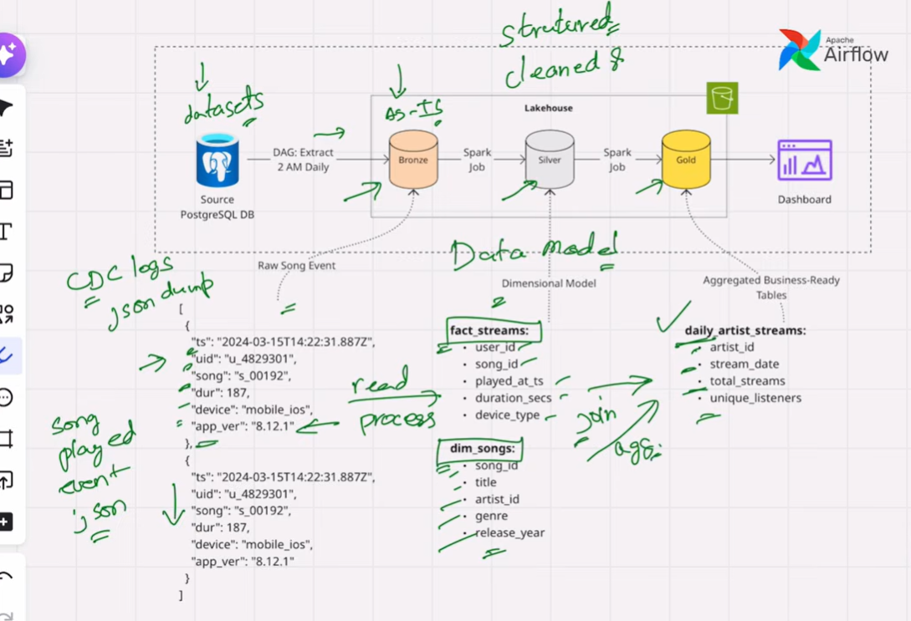
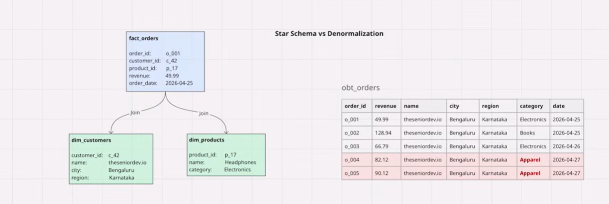
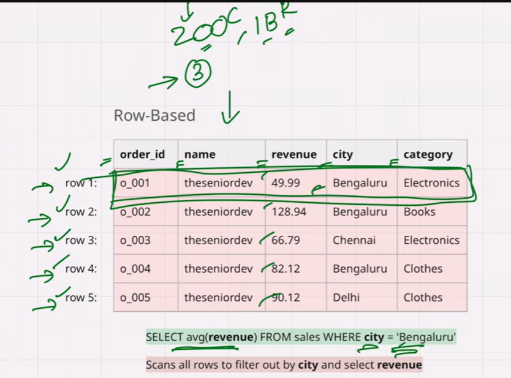
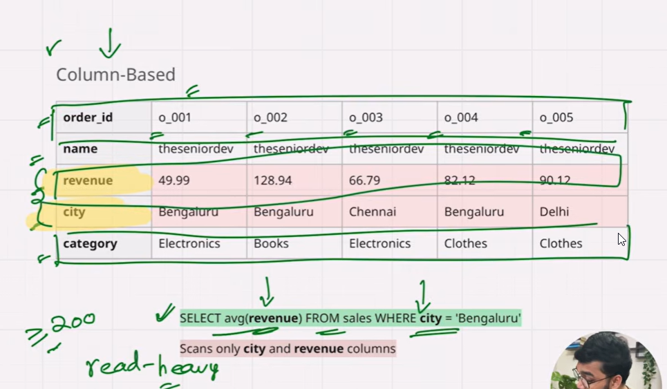

# Data Engineering System Design

> System design, unlike coding questions, is open-ended. There's no *single* correct answer — if you ask 10 senior engineers to design the same ingestion pipeline, you'll get 10 valid architectures, each optimizing different trade-offs: cost, latency, complexity, or failure handling. There's no universally optimal solution; optimality depends on the constraints. That's why justifying your choices and explaining trade-offs matters most.
>
> For example — ingestion patterns, data modeling, batch vs. streaming, schema evolution, idempotency, backfills, cost, and scale. Different topics, but the same way of thinking.
>
> And that's the whole point: every data engineering system design problem — a lakehouse for e-commerce, a recommendation pipeline, a fraud detection system, or a customer 360 platform — breaks down using the **same single framework**.
>
> And that framework is exactly what we're building today.

---

## 6-Step Framework


| # | Step | Focus |
|---|---|---|
| 1 | **Requirements Gathering** | Functional + Non-functional (+ Back-of-Envelope Calculations) |
| 2 | **Pipeline Design** | Batch, Streaming, Lambda, Kappa |
| 3 | **Data Modeling** | Medallion, Star, OBT, SCD |
| 4 | **Storage & File Formats** | Parquet, Avro, Delta Lake, Iceberg |
| 5 | **Data Quality & Observability** | DQ Dimensions, Data Contracts, Pipeline Observability |
| 6 | **Scalability, Backfill & DataOps** | Idempotency, Backfills, Schema Evolution |

---

## Step 1 — Requirements Gathering

Understanding the problem *before you draw a single box on the whiteboard*. It's about understanding the system you've been asked to build, not jumping straight into architecture.

At this stage, you should ask questions like:

- **Who is the user?** Who will actually consume this system?
- **What functionalities does it need to offer?** What exactly is it supposed to do?
- **What are the latency requirements?** For example, if the end users are the marketing team looking at 3–5 dashboards, do they need 5-minute freshness, or is a once-a-day refresh good enough?
- **What is the volume of data?** Are we processing megabytes, gigabytes, terabytes, or petabytes?

Knowing these facts upfront will **drastically influence every downstream decision** — pipeline design, storage choices, processing engine, and overall architecture.

This is also where **back-of-the-envelope calculations** come in, which we'll cover shortly.

Requirements gathering splits into two categories:


### Functional Requirements

Functional requirements define **what the system must do** — the consumers, the data they need, and how they'll access it.

#### 1. Who are the end users?
Identify *every* downstream consumer of the system.
- **Data Analysts** — exploratory analysis, ad-hoc SQL
- **ML / Data Science teams** — feature stores, training datasets
- **Business / End Customers** — dashboards (Power BI, Tableau, Looker)
- **External / Partner teams** — shared datasets, data products
- **Operational systems** — apps consuming data via APIs

#### 2. What data do they actually need?
The *shape* and *granularity* of the output drives the entire pipeline design.
- **Aggregate metrics** — daily/weekly KPIs, rollups
- **Raw / event-level data** — clickstream, transactions, logs
- **Historical snapshots** — point-in-time views, SCD Type 2
- **Features** — engineered attributes for ML models
- **Curated metrics** — governed, certified business measures

#### 3. How will they access it?
The access pattern determines the **serving layer**.
- **SQL queries** — warehouse (Snowflake, BigQuery, Synapse) or lakehouse (Databricks SQL, Fabric)
- **BI tools** — Power BI, Tableau, Looker
- **REST APIs / low-latency endpoints** — application-facing services
- **Notebooks / Spark jobs** — ML and data science workflows
- **File exports / data shares** — Delta Sharing, S3 drops, SFTP

#### Why this matters

| Question | Drives decision on |
|---|---|
| Who are the users? | Access control, SLAs, support model |
| What data do they need? | Data modeling (star, OBT, SCD), granularity, retention |
| How will they access it? | Serving layer (warehouse, lakehouse, API, cache) |

---

### Non-Functional Requirements

Non-functional requirements define **how the system should behave** — not *what* it does, but *how well* it does it.

For example: *Can it handle 10 TB of data per day? Can it refresh within an hour? Can it stay up if a node fails?*

These are the key areas you should always dig into:

#### 1. Volume
*How much data are we processing?*
- Per day / per hour / per event
- MB → GB → TB → PB
- Drives storage, partitioning, and compute sizing decisions

#### 2. Velocity (Latency & Freshness)
*How fast does data need to move end-to-end?*
- Real-time (<1 second) → streaming (Kafka, Flink)
- Near real-time (seconds to minutes) → micro-batch
- Batch (hourly / daily) → scheduled ETL/ELT
- Drives the choice between **batch, streaming, Lambda, or Kappa** architectures

#### 3. Scalability
*Can the system grow with data and users?*
- Horizontal scaling (add more nodes) vs. vertical scaling (bigger nodes)
- Elastic / auto-scaling compute
- Concurrency for serving layer (how many simultaneous queries?)

#### 4. Reliability & Availability
*What happens when things fail?*
- Uptime SLA (99.9% vs. 99.99%)
- Fault tolerance, retries, dead-letter queues
- Disaster recovery — RPO (data loss tolerance) and RTO (recovery time)

#### 5. Consistency & Accuracy
*How correct does the data need to be?*
- Strong vs. eventual consistency
- Exactly-once vs. at-least-once delivery
- Idempotency for safe reprocessing

#### 6. Security & Compliance
*Who can access what, and under what rules?*
- AuthN / AuthZ, row- and column-level security
- Encryption at rest and in transit
- PII handling, GDPR, HIPAA, data residency

#### 7. Cost
*What's the budget envelope?*
- Storage vs. compute trade-offs
- Serverless vs. provisioned clusters
- Hot vs. warm vs. cold storage tiering

#### 8. Maintainability & Observability
*Can the team operate and evolve the system?*
- Monitoring, alerting, lineage, data quality checks
- Schema evolution support
- Ease of onboarding new pipelines

#### 9. Data Retention

*How long do we keep the data, and what do we do with it after?*

Data retention defines **the lifecycle of data** — from ingestion to archival to deletion.

**Key questions:**
- How long must we retain the data? 30 days? 7 years? Forever?
- Why — business need, regulatory requirement, or audit trail?
- What happens after retention expires — delete, archive, or anonymize?
- Different retention per zone? (e.g., raw = 90 days, curated = 2 years, aggregates = 7 years)

#### Why NFRs matter

| NFR | Drives decision on |
|---|---|
| Volume | Storage format, partitioning, cluster size |
| Latency | Batch vs. streaming, ingestion pattern |
| Scalability | Compute engine, architecture pattern |
| Reliability | Retry logic, DR strategy, replication |
| Consistency | Exactly-once design, idempotency |
| Security | Access control, encryption, masking |
| Cost | Tiering, serverless vs. provisioned |
| Maintainability | Orchestration, observability stack |
| Retention | Storage tiering, lifecycle policies, GDPR deletion workflow |

---

### Back-of-the-Envelope (BOE) Calculation

Rough calculation used to estimate scale — data volumes, throughput, latency, and cost — before finalizing the architecture.

#### Step 1 — State the inputs (assumptions you state out loud)

Before any math, list assumptions explicitly. In an interview, **say them aloud** — interviewers care more about reasoning than exact numbers.

| Input | Assumption | Notes |
|---|---|---|
| Daily active users on Azure portal | 5 million | Stated assumption |
| Avg events per user per day (clicks, page views, sessions) | 50 | Mix of clicks + page nav + session events |
| Avg event size (raw JSON from Kusto) | 2 KB | Includes telemetry headers, user agent, geo, etc. |
| Retention — Bronze | 90 days | Raw audit trail |
| Retention — Silver | 2 years | Curated data for analytics |
| Refresh frequency | Hourly micro-batch from Kusto | Driven by NFR |
| Compression ratio (Parquet/Delta) | 5× | Typical for telemetry JSON → Parquet |

#### Step 2 — Volume calculations

**A. Daily event count**

$$
5{,}000{,}000 \text{ users} \times 50 \text{ events} = 250{,}000{,}000 \text{ events/day} \approx 250\text{M events/day}
$$

**B. Daily raw data size (from Kusto → Bronze)**

$$
250{,}000{,}000 \times 2\text{ KB} = 500{,}000{,}000\text{ KB} = 500\text{ GB/day raw JSON}
$$

**C. After Parquet/Delta compression (Bronze on-disk)**

$$
\frac{500\text{ GB}}{5} = 100\text{ GB/day in Bronze (Delta)}
$$

**D. Per-hour ingestion rate (hourly micro-batch)**

$$
\frac{500\text{ GB}}{24\text{ hr}} \approx 21\text{ GB/hour raw} \;\;(\approx 4\text{ GB/hour compressed})
$$

$$
\frac{250{,}000{,}000}{86{,}400\text{ sec}} \approx 2{,}900\text{ events/sec average}
$$

> **Peak factor:** assume 3× peak vs. average → **~8,700 events/sec at peak**.

**E. Silver layer size**

Silver typically drops noise, deduplicates, and keeps ~60–70% of Bronze:

$$
100\text{ GB} \times 0.65 \approx 65\text{ GB/day in Silver}
$$

**F. Storage footprint over retention period**

| Layer | Daily | Retention | Total Storage |
|---|---|---|---|
| Bronze (Delta, compressed) | 100 GB | 90 days | ~9 TB |
| Silver (Delta, compressed) | 65 GB | 2 years (730 days) | ~47 TB |
| Gold / Aggregates (assume 5% of Silver) | ~3 GB | 5 years | ~5 TB |
| **Total Lakehouse footprint** | — | — | **~61 TB** |

#### Step 3 — Cost back-of-envelope (rough)

Using **ADLS Gen2 hot tier ≈ $0.018/GB/month**:

$$
61{,}000\text{ GB} \times \$0.018 \approx \$1{,}100\text{/month storage}
$$

Compute (Databricks/Fabric hourly job) — small cluster (~4 nodes, 2 hrs/day):

$$
\approx \$300\text{–}\$500\text{/month}
$$

Kusto egress (if pulling cross-region): add ~$0.02/GB × 500 GB/day × 30 ≈ **$300/month**.

**Total estimated monthly cost: ~$2K/month** for this pipeline.

#### Step 4 — What these numbers tell you about the design

| Number | Design implication |
|---|---|
| 250M events/day, 500 GB/day raw | **Not "big data"** — single Spark cluster or even Fabric F32 capacity is sufficient |
| ~2.9K events/sec avg, ~8.7K peak | **Hourly micro-batch is fine** — no need for true streaming (Kafka/Flink) |
| 100 GB/day Bronze, 9 TB total | **Partition by `event_date`** + maybe `event_type`; ~1 GB partitions = healthy file sizes |
| Kusto as source | Use **Kusto export to ADLS** or **Spark Kusto connector**; pull incrementally by `ingestion_time()` |
| 2-year Silver retention | **Tier old partitions to cool storage** after 90 days; keep recent hot |
| ~$2K/month | Cost is small → don't over-engineer with streaming infra |

#### Step 5 — How to present in an interview / design doc

> "Let me size this quickly. Azure portal has roughly **5 million DAU**, and each user generates about **50 telemetry events/day** — clicks, page views, sessions. At ~2 KB per event, that's **~500 GB/day** of raw JSON from Kusto, or **~100 GB/day** in Delta after compression.
>
> Average ingestion rate is **~3K events/sec**, peaking around **~9K/sec**. Since the freshness requirement is hourly, **micro-batch pulls from Kusto are sufficient — we don't need streaming infrastructure**.
>
> Over **90-day Bronze** and **2-year Silver** retention, the total Lakehouse footprint is **~60 TB**, which costs roughly **$2K/month** all-in. This tells me the system is firmly in the **mid-size analytics** category — a single Databricks/Fabric workspace handles it easily, and I should focus the design on **partitioning, schema evolution, and incremental ingestion from Kusto** rather than on extreme scale."

#### Reusable BOE template

| # | Question | Your answer |
|---|---|---|
| 1 | DAU / source event rate | 5M users × 50 events |
| 2 | Avg event size | 2 KB |
| 3 | Raw daily volume | 500 GB/day |
| 4 | Compressed volume (Delta/Parquet, ~5×) | 100 GB/day |
| 5 | Events/sec (avg, peak) | 2.9K / 8.7K |
| 6 | Retention per zone | Bronze 90d / Silver 2y / Gold 5y |
| 7 | Total storage footprint | ~60 TB |
| 8 | Rough monthly cost | ~$2K |
| 9 | Implication for design | Micro-batch, not streaming |

---

## Step 2 — Pipeline Design

Pipeline design is about **how** data moves and transforms from source A to destination B. The **first decision — and the most important one — is batch versus streaming**, because it drives every downstream choice: tools, cost, complexity, and latency. Right after that come the other key decisions: **full load or incremental? ETL or ELT? Push or pull? And what delivery guarantees do we need?**

### 1. Batch Processing

Batch processes large volumes of data at scheduled intervals — cheaper, simpler, and perfect for reporting and analytics.

**Example:** ~90% of the projects I've worked on are batch-based, where data is pulled once a day and propagated across all layers (Bronze → Silver → Gold).


### 2. Stream Processing

Streaming processes events continuously as they arrive — powerful for real-time use cases, but more expensive and complex.

**Example:** Azure Portal telemetry, where user events are captured through **Event Hub** and streamed into a **Kusto (ADX) cluster** for near real-time querying.


### 3. Micro-batch (Hybrid)

Micro-batch sits between the two and covers most **"near real-time"** needs. Pick based on your **latency SLA**, not on hype.

**Example:** NRT Compute Usage pipeline — a Spark job is triggered **every 15 minutes** to pull data from Kusto, land it in Bronze, and process it through Silver and Gold. The entire cycle completes in **under 30 minutes**, giving near real-time freshness without the cost and complexity of true streaming.

### Trade-off — Batch vs. Streaming

| Dimension | **Batch** | **Streaming** |
|---|---|---|
| Definition | Process large volumes of data in scheduled chunks | Process each event (or micro-batch) as it arrives |
| Data boundary | Bounded (finite dataset per run) | Unbounded (continuous, never-ending stream) |
| Latency | Minutes to hours (typically hourly/daily) | Milliseconds to seconds |
| Freshness | Stale — reflects data as of last run | Near real-time — reflects data within seconds |
| Processing model | Pull — job fetches data at scheduled time | Push — data flows continuously into the system |
| Trigger | Time-based (cron, DAG schedule) | Event-based (new record arrives) |
| Throughput | Very high (optimized for large scans) | Lower per-record cost but continuous |
| Complexity | Low to medium | High (state, watermarks, late data, ordering) |
| Cost | Cheaper (compute runs only when needed) | Higher (always-on infrastructure) |
| Failure recovery | Simple — just re-run the failed job | Complex — need checkpointing, replay, offsets |
| Idempotency | Easy — overwrite partition, MERGE | Hard — needs dedup keys, exactly-once semantics |
| Backfills | Trivial — re-run for a date range | Difficult — replay from Kafka offsets |
| State management | Stateless (each run is independent) | Stateful (windows, aggregations across events) |
| Ordering guarantees | Not a concern | Critical — out-of-order and late events must be handled |
| Typical tools | Spark, dbt, Airflow, ADF, Fabric Pipelines, Snowflake tasks | Kafka, Flink, Spark Structured Streaming, Kinesis, Event Hubs |
| Delivery guarantees | Exactly-once (natural via overwrite) | At-least-once or exactly-once (harder to achieve) |
| Debugging | Easy — inspect input files, re-run | Hard — trace events across time and state |
| Team skill required | SQL / Python / Spark | Streaming expertise (Flink, Kafka, watermarks) |
| Best for | Reporting, historical analytics, ML training, monthly rollups | Fraud detection, real-time dashboards, alerting, personalization, IoT |
| Not good for | Real-time use cases (SLA < 5 min) | Simple daily reports (overkill and expensive) |

### Data Processing Patterns

1. **Batch (Traditional):** Data is collected over a period and processed in large chunks at scheduled intervals. Ideal for tasks that don't require immediate processing.

2. **Stream Processing:** Stream processing handles data in real-time as it arrives from sources. Instead of waiting for a batch, data is processed continuously, enabling instant analysis and reactions to events, ideal for real-time analytics and alerts.

3. **Lambda Architecture (Batch + Stream):** Lambda architecture is a way of processing massive quantities of data (i.e. "Big Data") that provides access to batch-processing and stream-processing methods with a hybrid approach. Lambda architecture is used to solve the problem of computing arbitrary functions. The lambda architecture itself is composed of 3 layers: Batch, Speed(Streaming) and Serving.


4. **Kappa Architecture (Stream Only):** Simplifies architecture by using only stream processing. It assumes that all data can be treated as a stream, even if it's originally processed as a batch. This eliminates the need for a separate batch processing system.


5. **Delta Architecture (Unified Batch + Streaming):** A modern alternative to Lambda, popularized by Databricks. It uses **Delta Lake's ACID transactions** to let the *same pipeline* handle both batch and streaming workloads through the **same tables** — eliminating Lambda's dual-codebase problem. The Medallion layers (Bronze → Silver → Gold) are typically implemented as Delta tables, with streaming and batch jobs reading and writing to the same target. Best when you're already on Delta Lake / Databricks / Fabric and want unified real-time + historical processing without dual maintenance.

```
Streaming source ────┐
                   ├──▶ Bronze (Delta) ──▶ Silver (Delta) ──▶ Gold (Delta) ──▶ Serving
Batch source ───────┘        │                  │                  │
                            └── same Delta tables serve both streaming & batch reads/writes
                                (ACID + MERGE + streaming APIs + time travel)
```

### Lambda vs. Kappa vs. Delta — Trade-off

| Dimension | **Lambda** | **Kappa** | **Delta Architecture** |
|---|---|---|---|
| Pipelines | Two (batch + streaming) | One (streaming) | **One unified (Delta tables)** |
| Codebases | Two — must stay in sync | One | **One** |
| Batch support | Native | Via replay | **Native** |
| Streaming support | Native | Native | **Native** |
| Real-time freshness | ✅ (via speed layer) | ✅ (native) | ✅ (streaming writes) |
| Historical accuracy | ✅ High (batch is source of truth) | ✅ High (via replay) | ✅ High (time travel) |
| Complexity | High (dual maintenance) | Medium (streaming expertise) | **Low to medium** |
| Cost | Higher (two systems) | Lower to medium | **Lower (single stack)** |
| Backfills | Easy (batch layer) | Slower (replay from log) | **Easy (re-run on Delta)** |
| Late-arriving data | Corrected by batch layer | Watermarks + replay | **MERGE handles late records** |
| Storage foundation | Any (HDFS, S3) | Kafka + any | **Delta Lake (ACID)** |
| Reprocessing | Re-run batch layer | Kafka replay | **Just re-run on Delta** |
| Vendor coupling | Low | Low–medium | **Delta / Databricks (opening via UniForm & OSS Delta)** |
| Best for | Mixed batch/real-time SLAs, mature orgs | Streaming-native use cases | **Modern lakehouse platforms (Databricks, Fabric)** |

### Full Load vs. Incremental vs. CDC

1. **Full Load:** Extracting and transferring the entire dataset from source and overwrite the existing data with newer data.

2. **Incremental:** Load transfers only new or updated data since the last load, using timestamps, sequence numbers, or version numbers to identify changes.

3. **Change Data Capture (CDC):** Is a method used to identify and capture changes (inserts, updates and deletes) made to data in a source database, allowing these changes to be efficiently propagated to other systems, such as data warehouses, data lakes, or downstream applications. CDC helps in maintaining data consistency and enabling real-time or near-real-time data integration, minimizing data transfer and processing time.

### ETL vs. ELT

Both patterns move data from source to target, but they differ in **where** and **when** the transformation happens.

1. **ETL (Extract → Transform → Load):** Data is extracted from the source, transformed by an **external engine** (Spark, Informatica, SSIS), and only the transformed result is loaded into the target. Raw data is typically discarded. Common in legacy on-prem data warehouses.

2. **ELT (Extract → Load → Transform):** Data is extracted and loaded **as-is (raw)** into the target, and transformations run **inside the warehouse/lakehouse** using its native compute (SQL, dbt, Databricks). Raw data is preserved for reprocessing. This is the **modern default** for cloud data platforms.

#### ETL vs. ELT — Trade-off

| Aspect | **ETL** (Extract → Transform → Load) | **ELT** (Extract → Load → Transform) |
|---|---|---|
| Order of operations | Transform *before* loading into target | Load raw first, transform *inside* target |
| Where transformation runs | External engine (Spark, Informatica, SSIS) | Target warehouse/lakehouse (SQL, dbt) |
| Raw data availability | Usually discarded after transform | Always kept in raw/Bronze layer |
| Compute cost | Separate ETL cluster | Uses warehouse compute (Snowflake, BigQuery, Databricks SQL) |
| Storage cost | Lower (only curated data stored) | Higher (raw + curated stored) |
| Speed to load | Slower (transform is a bottleneck) | Faster (raw lands immediately) |
| Schema handling | Schema-on-write (rigid) | Schema-on-read (flexible) |
| Reprocessing | Hard — raw is gone | Easy — re-run SQL on raw |
| Best suited for | Small/medium data, complex transforms, on-prem DWs | Cloud warehouses & lakehouses, large volumes |
| Typical tools | Informatica, SSIS, Talend, Spark (transform-heavy) | dbt, Snowflake, BigQuery, Databricks, Fabric |
| When to choose | Legacy systems, strict governance, PII masking before load | Modern cloud stacks, big data, agile analytics |

> **Note:** The **Medallion architecture (Bronze → Silver → Gold)** is fundamentally an **ELT pattern** — raw data lands in Bronze, then transforms run downstream inside the lakehouse.

**One-line summary:** **ETL** transforms *before* loading (external compute, no raw kept). **ELT** loads raw first, then transforms *inside* the warehouse/lakehouse (cheaper storage compute, keeps raw, easier reprocessing). **Modern cloud stacks default to ELT.**

### Data Ingestion Patterns

1. **Push-based Ingestion:** In push-based ingestion, data is collected over time and processed in batches at scheduled intervals. This pattern is suitable for large volumes of data that don't require immediate processing.

2. **Pull-based Ingestion:** Pull-based ingestion is controlled by your platform. You initiate the import process, requesting data from the source at regular intervals or on-demand. **Trade-offs:** Must handle duplicates, risk of missed events, requires explicit requests, requires monitoring.

#### Pull vs. Push — Trade-off

| Dimension | **Pull** | **Push** |
|---|---|---|
| Who initiates? | Consumer (your pipeline) | Producer (source system) |
| Trigger | Scheduled (cron, DAG) or on-demand | Event-driven (as data is generated) |
| Latency | Higher — bound by pull interval | Lower — near real-time |
| Coupling | Loose — source doesn't know about you | Tighter — source must know where to send |
| Control | You control **when** and **how much** to fetch | Producer controls the pace |
| Backpressure | Easy — just pull less | Hard — producer can overwhelm you |
| Source impact | Load on source when you query | Continuous small load |
| Reliability | If pull fails, retry next cycle | Needs buffer/queue to avoid data loss |
| Missed data risk | Low — data waits in source | High — must buffer if consumer is down |
| Ordering | Easy — control the query | Depends on transport (Kafka partitions, etc.) |
| Setup effort | Simple — a job + connection string | Higher — producer + queue + consumer wiring |
| Best for | Databases, APIs, files, warehouses | Events, IoT, logs, telemetry, user activity |

---

## Step 3 — Data Modeling

### Medallion Architecture



---

### Star Schema Vs Denormalization



---

### Slowly Changing Dimensions (SCD)

SCD patterns define **how changes to dimension attributes are tracked over time**. Choosing the right SCD type is a core data modeling decision — it determines whether history is preserved, overwritten, or partially retained.

| SCD Type | Name | Description | Example |
|---|---|---|---|
| **Type 0** | Retain Original | Value is fixed at creation and **never updated**, regardless of source changes. | `date_of_birth` — never changes even if source is corrected |
| **Type 1** | Overwrite Existing Data | Existing data is updated with new values. The previous data is **overwritten** and only the most recent value is retained. Suitable when historical tracking is not required. | Tenant name changes from **"MAQ"** to **"MAQ Software"** — the old row is **replaced** by the new one. |
| **Type 2** | Preserving Historical Versions | A **new row** is inserted for every change, preserving full history. Tracked via metadata columns (`start_date`, `end_date`, `is_current`). Ideal when time-based analysis is needed. | For tenant **"MAQ"** changed to **"MAQ Software"** — the old row is closed (`is_current = false`, `end_date = today`) and a new row is inserted (`start_date = today`, `is_current = true`). Both versions coexist. |
| **Type 3** | Track Limited History | Adds **extra columns** (e.g., `previous_value`, `current_value`) to store the prior value alongside the current one. Only the last N versions are kept. | A `current_tenant_name` and `previous_tenant_name` column both exist on the same row. |
| **Type 4** | History Table | The main dimension table holds only the **current value**, while a **separate history table** stores all past versions. | `dim_tenant` has the current name; `dim_tenant_history` has every past name with timestamps. |
| **Type 6** | Hybrid (1 + 2 + 3) | Combines Types 1, 2, and 3. | Latest name shown on every row, plus historical rows with effective date ranges. |

**Example SCD Type 2 rows after a name change:**

| tenant_sk | tenant_id | tenant_name | start_date | end_date | is_current |
|---|---|---|---|---|---|
| 101 | T001 | MAQ | 2024-01-01 | 2026-07-01 | false |
| 102 | T001 | MAQ Software | 2026-07-01 | 9999-12-31 | true |

> **In practice, Type 1 and Type 2 cover ~95% of real-world use cases.** Type 2 is the default when history matters.

---

## Step 4 — Storage & File Formats

Once you know **what** data you're modeling (Step 3), the next question is **how it's physically stored on disk**. The single biggest decision here is **row-based vs. column-based** storage — it drives query speed, compression, and cost for every downstream workload.

### Row-Based vs. Column-Based

The difference is simply **how the bytes are laid out on disk**.

Take this sample `sales` table:

| order_id | name | revenue | city | category |
|---|---|---|---|---|
| o_001 | theseniordev | 49.99 | Bengaluru | Electronics |
| o_002 | theseniordev | 128.94 | Bengaluru | Books |
| o_003 | theseniordev | 66.79 | Chennai | Electronics |
| o_004 | theseniordev | 82.12 | Bengaluru | Clothes |
| o_005 | theseniordev | 90.12 | Delhi | Clothes |



#### Row-Based Storage

Each **row is stored contiguously** on disk — all columns of row 1, then all columns of row 2, and so on.

```
Row 1: o_001 | theseniordev | 49.99  | Bengaluru | Electronics
Row 2: o_002 | theseniordev | 128.94 | Bengaluru | Books
Row 3: o_003 | theseniordev | 66.79  | Chennai   | Electronics
Row 4: o_004 | theseniordev | 82.12  | Bengaluru | Clothes
Row 5: o_005 | theseniordev | 90.12  | Delhi     | Clothes
```

**Query:** `SELECT AVG(revenue) FROM sales WHERE city = 'Bengaluru'`

The engine must **scan every row** — reading `order_id`, `name`, `revenue`, `city`, and `category` for each — even though the query only cares about **2 out of 5 columns**. This is wasteful I/O.

✅ **Great for:** OLTP workloads — inserts, updates, deletes, and single-row lookups (e.g., "get me order o_003"). The whole row is in one place.
❌ **Bad for:** Analytical queries that touch a few columns across millions of rows.

#### Column-Based Storage

Each **column is stored contiguously** on disk — all values of `order_id`, then all values of `name`, then all values of `revenue`, etc.

```
order_id : o_001 | o_002 | o_003 | o_004 | o_005
name     : theseniordev | theseniordev | theseniordev | theseniordev | theseniordev
revenue  : 49.99 | 128.94 | 66.79 | 82.12 | 90.12
city     : Bengaluru | Bengaluru | Chennai | Bengaluru | Delhi
category : Electronics | Books | Electronics | Clothes | Clothes
```

**Same query:** `SELECT AVG(revenue) FROM sales WHERE city = 'Bengaluru'`

The engine reads **only the `city` and `revenue` columns** — skipping `order_id`, `name`, `category` entirely. On a 1 TB table with 50 columns, that's **~25× less I/O**.

Bonus: since each column stores values of the **same data type**, compression is dramatically better (e.g., all cities compress together — "Bengaluru" appears 3× and can be dictionary-encoded to a single byte).

✅ **Great for:** OLAP / analytical workloads — aggregations, filters, and column pruning across huge datasets.
❌ **Bad for:** Single-row inserts/updates (you'd have to touch every column file).

#### Row-Based vs. Column-Based — Trade-off

| Dimension | **Row-Based** | **Column-Based** |
|---|---|---|
| Storage layout | Rows contiguous | Columns contiguous |
| Best workload | **OLTP** (transactions, lookups) | **OLAP** (analytics, aggregations) |
| Read pattern | Fetch full row fast | Fetch specific columns fast |
| Compression | Poor (mixed data types per block) | **Excellent** (same type per block, dict/RLE encoding) |
| Column pruning | ❌ Must read whole row | ✅ Skip unwanted columns entirely |
| Predicate pushdown | Limited | ✅ Strong (min/max stats per column chunk) |
| Insert/update speed | ✅ Fast (single row write) | Slower (touches every column) |
| Aggregations (SUM, AVG) | Slow — scans everything | **Very fast** — reads only needed columns |
| Vectorized execution | Limited | ✅ Native — SIMD on column arrays |
| Storage size | Larger | ~3–10× smaller after compression |
| Typical engines | PostgreSQL, MySQL, SQL Server, Oracle | Snowflake, BigQuery, Databricks, Redshift, DuckDB |
| Best for | Application databases, order processing | Data lakes, warehouses, lakehouses, BI |

### Example File Formats

Every file format falls into one of three families based on how it lays out data.

#### 1. Row-Based Formats

| Format | Type | Notes |
|---|---|---|
| **CSV** | Plain text row | Human-readable, no schema, no compression, no types. Fine for tiny exports, terrible for analytics. |
| **JSON / JSONL** | Semi-structured row | Nested, schema-flexible. Common for API responses, logs, telemetry. Verbose and slow to scan. |
| **Avro** | Binary row + schema | Compact, schema-embedded, great for **streaming** (Kafka, Event Hub) and record-by-record writes. Splittable, supports schema evolution. Not ideal for analytical scans. |

**When to use:** streaming ingestion, message queues, write-heavy workloads, raw event landing.

#### 2. Column-Based Formats

| Format | Type | Notes |
|---|---|---|
| **Parquet** | Columnar binary | **The industry standard** for analytics. Column pruning, predicate pushdown, dictionary + RLE + Snappy/Zstd compression, min/max stats per row group. Used by Spark, Databricks, Fabric, Snowflake, Athena, BigQuery, DuckDB. |
| **ORC** | Columnar binary | Similar to Parquet but originated in the Hive ecosystem. Strong compression and built-in ACID support in Hive. Less common outside Hadoop. |

**When to use:** analytical queries, BI dashboards, data lake storage, ML training data — anywhere you scan billions of rows across a handful of columns.

#### 3. Table Formats (built *on top of* Parquet/ORC)

These aren't file formats themselves — they're **transactional table formats** that add a metadata layer (JSON log + manifests) on top of Parquet files to provide ACID, time travel, schema evolution, and MERGE.

| Format | Notes |
|---|---|
| **Delta Lake** | Open-source, Databricks-originated. ACID via `_delta_log/`. Native to Databricks, Fabric, and Synapse. Best MERGE performance. |
| **Apache Iceberg** | Open-source, Netflix-originated. Vendor-neutral. Great for multi-engine access (Spark, Trino, Flink, Snowflake, BigQuery). Hidden partitioning. |
| **Apache Hudi** | Open-source, Uber-originated. Optimized for **CDC and upserts** at scale (streaming writes, incremental pulls). |

**When to use:** modern lakehouse. This is where **Bronze / Silver / Gold** tables live.

#### Format Selection — Quick Rule of Thumb

| Use case | Best format |
|---|---|
| Streaming ingestion (Kafka, Event Hub) | **Avro** |
| API export / interop with other systems | **JSON** or **CSV** |
| Raw event landing (Bronze) | **Delta / Iceberg** (Parquet under the hood) |
| Curated analytics tables (Silver / Gold) | **Delta / Iceberg** |
| Ad-hoc analytical files (no ACID needed) | **Parquet** |
| OLTP application database | **Not a file format** — use PostgreSQL / SQL Server |

**One-line summary:** **Row formats (CSV, JSON, Avro) optimize for writes and record-level access. Columnar formats (Parquet, ORC) optimize for analytical reads. Table formats (Delta, Iceberg, Hudi) add ACID and time travel on top of columnar files — this is what modern lakehouses use.**

---

## Step 5 — Data Quality & Observability

Once the pipeline runs, the next question is: **can we trust the data, and can we see what's happening inside the pipeline?** These are two different problems:

- **Data Quality (DQ)** — *is the data itself correct?* (values, freshness, completeness)
- **Observability** — *is the pipeline itself healthy?* (runs, latency, failures, lineage)

You need both. A pipeline can run "green" (no job failures) while quietly producing garbage data — and vice versa.

### DQ Dimensions

Data quality isn't a single metric — it's measured across **six standard dimensions**. Every DQ check you write maps to one of these.

| # | Dimension | Question it answers | Example check |
|---|---|---|---|
| 1 | **Accuracy** | Does the data match reality? | Order totals in Silver match the source system totals |
| 2 | **Completeness** | Is any expected data missing? | `null` rate on `user_id` is 0%; row count today ≥ 95% of 7-day avg |
| 3 | **Consistency** | Does the same fact agree across systems / tables? | `revenue` in Gold matches `SUM(revenue)` in Silver |
| 4 | **Timeliness (Freshness)** | Is the data recent enough for its SLA? | Latest `event_time` in Bronze is within 90 minutes |
| 5 | **Uniqueness** | Are there duplicates where there shouldn't be? | `order_id` is unique in `fact_orders` |
| 6 | **Validity** | Do values conform to defined rules / ranges / types? | `revenue >= 0`; `country_code IN ('US','IN','GB',…)`; `email` matches regex or KPI Drift or Row Count drift|
| 7 | **Schema Drift** | Validate schema between source and our system | |

**Where DQ checks run in the Medallion architecture:**

| Layer | Typical DQ focus |
|---|---|
| **Bronze** | Ingestion-level — schema conformance, row-count sanity, freshness of source pull |
| **Silver** | Transformation-level — uniqueness, referential integrity, null constraints, business rules |
| **Gold** | Business-level — metric reconciliation, cross-system consistency, YoY reasonableness |

**Common tools:** Great Expectations, Soda, dbt tests, Databricks DLT expectations, Delta constraints (`CHECK`, `NOT NULL`), Fabric Data Wrangler.

**Actioning failures — three tiers:**

1. **Warn** — log and continue (e.g., minor null rate breach on non-critical column).
2. **Quarantine** — write bad rows to a `_rejected` table, continue with clean rows.
3. **Fail (halt pipeline)** — stop processing immediately (e.g., duplicate primary keys, source row count dropped >50%).

Choose per-check based on **blast radius**, not uniformly.

---

### Data Contracts

A **data contract** is an *explicit, versioned agreement* between a data **producer** (upstream team / source system) and a data **consumer** (your pipeline / downstream users) about **what the data will look like and behave like**.

It flips the traditional model — instead of consumers discovering breakages *after* production incidents, producers commit to a contract *before* releasing changes.

**What a contract typically declares:**

| Element | Example |
|---|---|
| **Schema** | Column names, types, nullability |
| **Semantics** | `revenue` is in USD, gross, excludes refunds |
| **SLA — Freshness** | Data lands in Bronze within 60 minutes of event time |
| **SLA — Availability** | 99.9% uptime for the source API |
| **Volume expectations** | Between 200M–300M events/day |
| **Allowed changes** | Additive-only; breaking changes require 30-day notice |
| **Ownership** | Producer team + on-call contact |
| **Versioning** | `v1.2` → `v2.0` for breaking changes |

**Typical formats:** YAML or JSON files stored in Git alongside the producer's code — e.g., `contracts/portal-telemetry-v1.yaml`.

**Enforcement points:**

- **CI/CD** — reject producer PRs that break the contract schema
- **Ingestion** — validate incoming payload against the contract (schema registry, Avro/Protobuf)
- **Runtime** — DQ checks in Bronze verify contract expectations (row counts, freshness, value ranges)

**Why contracts matter:** they shift DQ **left** — problems get caught at the producer boundary, not 5 hops downstream in a broken dashboard.

**Common tools:** Confluent Schema Registry, Protobuf/Avro schemas, Great Expectations suites, dbt sources, Datahub / OpenMetadata contract definitions.

---

### Pipeline Observability

Observability answers: *"What is the pipeline doing right now, and what did it do yesterday?"* It's built on **three pillars** — the same as for microservices, adapted to data.

| Pillar | For data pipelines, this means… |
|---|---|
| **Metrics** | Job duration, rows read/written, bytes shuffled, cluster utilization, retry counts, freshness lag |
| **Logs** | Structured logs from each task — source, timestamp, correlation ID, error stack traces |
| **Traces** | End-to-end lineage of a single run: source pull → Bronze write → Silver merge → Gold aggregation |

**The five things every DE pipeline must emit:**

1. **Run status** — success / failure / running / skipped, with start & end timestamps
2. **Volume metrics** — rows in, rows out, rows rejected per step
3. **Latency / freshness** — `now() - max(event_time)` for each layer
4. **DQ results** — pass/fail counts per dimension, linked to run ID
5. **Lineage** — which upstream tables/files fed this run, and which downstream tables depend on it

**Alerting hierarchy (avoid alert fatigue):**

| Severity | Trigger | Action |
|---|---|---|
| **P1 — Page on-call** | Prod job failed; freshness > 2× SLA; DQ hard-fail on critical table | Immediate pager |
| **P2 — Email / ticket** | Retry succeeded; DQ warning; volume anomaly | Same-day investigation |
| **P3 — Dashboard only** | Slow run (still within SLA); minor null-rate uptick | Weekly review |

**What "good observability" looks like:**

- Every run has a **unique run ID** carried through logs, metrics, and DQ results.
- **Freshness lag** is visible on a single dashboard per table.
- **Lineage** is auto-captured (Unity Catalog, Purview, OpenLineage, DataHub) — not maintained manually.
- **Backfills and reruns** are distinguishable from scheduled runs.
- **Alerts route to the owning team**, not a shared inbox.

**Common tools:** Azure Monitor + Log Analytics, Databricks Job runs UI, Fabric Monitoring Hub, OpenLineage, Marquez, DataHub, Monte Carlo, Elementary (for dbt), Prometheus + Grafana.

**One-line summary:** **DQ tells you if the data is right. Observability tells you if the pipeline is healthy. Data contracts prevent the two from breaking silently.**

---

## Step 6 — Pipeline Resilence

Pipelines will fail — jobs crash, clusters die, source APIs time out, deploys go bad. **Resilience is how gracefully the pipeline recovers.** The three pillars are **idempotency**, **backfills**, and **schema evolution**.

### Idempotency

**Definition:** An operation is **idempotent** if running it *N* times produces the **same result** as running it *once*.

$$
f(x) = f(f(x)) = f(f(f(x))) \;\;=\; \text{same output}
$$

In data engineering, this means: **re-running a job (or a partition) must not produce duplicates, double-counted metrics, or corrupted state.**

#### Why it matters

Every real pipeline gets re-run — because of retries, backfills, late data, deploys, or human error. Without idempotency, every re-run risks **data corruption**.

| Scenario | Non-idempotent pipeline | Idempotent pipeline |
|---|---|---|
| Job fails at 90% and retries | Duplicate rows for the 90% already written | Same final state — retries are safe |
| Backfill re-runs yesterday's partition | Yesterday's data doubles | Yesterday's data is overwritten cleanly |
| Late-arriving events for a closed day | Appended → duplicated | Merged → replaced or upserted |
| Deploy pushes buggy transform, then fix | Bad rows linger forever | Re-run the fix, state is corrected |

**Rule of thumb:** *If you can't safely re-run a job, you don't have a pipeline — you have a landmine.*

#### The 4 core patterns

##### 1. Overwrite by partition (simplest)

Every run **fully replaces** the partition it's responsible for. Great for batch/micro-batch pipelines partitioned by date.

```python
# Spark — overwrite only today's partition, leave others untouched
(df_today
    .write
    .format("delta")
    .mode("overwrite")
    .option("replaceWhere", "event_date = '2026-07-06'")
    .save("/lakehouse/bronze/portal_events"))
```

✅ **Best for:** Bronze/Silver time-partitioned tables where each run owns a full partition.
⚠️ **Watch out:** must set `replaceWhere` — otherwise you nuke the whole table.

##### 2. MERGE / UPSERT (by primary key)

Use a natural or surrogate key to **update if exists, insert if not.** Duplicates are impossible by construction.

```sql
MERGE INTO silver.orders t
USING staging.orders s
  ON t.order_id = s.order_id
WHEN MATCHED AND s.updated_at > t.updated_at THEN UPDATE SET *
WHEN NOT MATCHED THEN INSERT *
```

✅ **Best for:** dimension tables, SCD Type 1/2, CDC pipelines, Silver curated tables.
⚠️ **Watch out:** MERGE is expensive at scale — needs a good `ON` predicate and often a partition/`ZORDER` on the key.

##### 3. Deterministic keys (deduplication safety net)

Every row gets a **deterministic ID** derived from its content (`hash(source + event_id + event_time)`). Any duplicate produces the same key, so a downstream `DISTINCT` or MERGE naturally deduplicates.

```python
from pyspark.sql.functions import sha2, concat_ws

df_with_key = df.withColumn(
    "row_key",
    sha2(concat_ws("||", "source", "event_id", "event_time"), 256)
)
```

✅ **Best for:** streaming or at-least-once ingestion where the source may replay events.
⚠️ **Watch out:** the key must be **stable** — never include `now()` or the current run ID.

##### 4. Transactional writes (all-or-nothing)

The **write itself** must be atomic — either the whole batch commits or nothing does. Half-written state after a crash is the enemy of idempotency.

- **Delta Lake / Iceberg / Hudi** — ACID commits via transaction log. A failed write leaves the table untouched.
- **Warehouses** (Snowflake, BigQuery) — use `BEGIN … COMMIT` or MERGE inside a transaction.
- **Object storage without ACID** (raw Parquet on ADLS/S3) — write to a temp path, then **atomic rename** on success.

✅ **Best for:** any target that supports transactions — always prefer Delta/Iceberg over raw Parquet in Bronze/Silver/Gold.

#### Common idempotency killers

| Anti-pattern | Why it breaks | Fix |
|---|---|---|
| `INSERT INTO … SELECT …` on every run | Every retry appends duplicates | Use MERGE, or overwrite the partition |
| `current_timestamp()` in the row key | Same input → different key on retry | Use event time or source-provided ID |
| Auto-increment surrogate keys generated per run | Retries produce different keys for the same row | Generate keys deterministically from business key |
| Appending to raw Parquet on ADLS | Failed write leaves partial files | Use Delta/Iceberg or write-then-rename |
| Two jobs writing to the same target concurrently | Race conditions, lost updates | Use table-level locking (Delta) or single-writer discipline |
| Reading `SELECT MAX(event_time)` from target to decide watermark | Retry uses wrong watermark | Persist watermark in a dedicated state table |

#### Checklist — is your pipeline idempotent?

Ask these five questions about **every** table your pipeline writes:

1. If I re-run today's job **right now**, will the output be identical? ✅ / ❌
2. If a run **crashes at 50%** and retries, are duplicates possible? ✅ / ❌
3. If I **backfill last month**, will it corrupt anything downstream? ✅ / ❌
4. If the **source replays** the same event twice, does my target dedupe? ✅ / ❌
5. Is every write **atomic** (all-or-nothing)? ✅ / ❌

If any answer is ❌, that's where the next production incident will come from.

**One-line summary:** **Idempotent = safe to re-run.** Achieve it via **partition overwrite**, **MERGE on a key**, **deterministic row keys**, and **transactional writes** (Delta/Iceberg). Everything else is a duplicate waiting to happen.

---

### Backfills

**Definition:** A **backfill** is re-running a pipeline for a **past date range** — either because the pipeline is new (needs history), the pipeline was broken for a few days, the source dropped late data, or a bug was fixed and past data must be recomputed.

**Rule #1:** Backfills are only safe if the pipeline is **idempotent** (previous section). Without idempotency, a backfill *creates the very corruption* it was meant to fix.

#### When you need a backfill

| Scenario | Example |
|---|---|
| **New pipeline going live** | Load last 90 days of history into Bronze |
| **Pipeline was broken** | Job failed silently for 3 days — re-run those 3 days |
| **Bug fix** | Transform logic had an off-by-one; recompute the last 30 days |
| **Late-arriving data** | Source finally sent data for last week — reprocess those partitions |
| **Schema change** | New column added — populate historical rows |
| **Source correction** | Upstream team restated 6 months of revenue — reprocess Silver + Gold |

#### Two design philosophies

There are two common ways to handle backfills. **Pick one and stick to it.**

##### Option A — Same notebook, `backfill` parameter (recommended)

The **same** Bronze / Silver / Gold notebook that runs daily can also run in backfill mode via a parameter. No separate pipeline, no duplicated code, no drift.

**This is the approach used in our real pipeline.** Each layer's notebook accepts:

| Parameter | Purpose |
|---|---|
| `backfill` | `true` / `false` — toggles backfill mode |
| `start_date` | First date (inclusive) to reprocess |
| `end_date` | Last date (inclusive) to reprocess |

When `backfill=true`, the notebook **iterates over the date range** and reprocesses each partition through Bronze → Silver → Gold, using the **exact same transformation code** as the daily run.

```python
# Databricks / Fabric notebook — top of Bronze notebook
dbutils.widgets.text("backfill", "false")
dbutils.widgets.text("start_date", "")
dbutils.widgets.text("end_date", "")
dbutils.widgets.text("run_date", "")

backfill    = dbutils.widgets.get("backfill").lower() == "true"
run_date    = dbutils.widgets.get("run_date")
start_date  = dbutils.widgets.get("start_date")
end_date    = dbutils.widgets.get("end_date")

# Build the list of dates to process
if backfill:
    dates = pd.date_range(start_date, end_date).strftime("%Y-%m-%d").tolist()
else:
    dates = [run_date or datetime.utcnow().strftime("%Y-%m-%d")]

# Loop through each date — same logic for daily & backfill
for d in dates:
    print(f"Processing {d} …")
    df = read_from_kusto(event_date=d)
    (df.write
        .format("delta")
        .mode("overwrite")
        .option("replaceWhere", f"event_date = '{d}'")   # idempotent!
        .save("/lakehouse/bronze/portal_events"))
```

**Chaining across layers:** the orchestrator (ADF, Fabric Pipeline, Databricks Workflow) runs Bronze → Silver → Gold notebooks in sequence, passing the same `backfill`, `start_date`, `end_date` parameters to all three.

**Why this pattern wins:**

| Benefit | Why it matters |
|---|---|
| ✅ **Single codebase** | Daily logic and backfill logic can never drift |
| ✅ **No extra pipeline to build** | Nothing new to deploy, monitor, or maintain |
| ✅ **Same DQ checks apply** | Backfilled data goes through the exact same validation as daily runs |
| ✅ **Cheap to trigger** | Just re-run the notebook with different widgets |
| ✅ **Naturally idempotent** | Each date overwrites its own partition (`replaceWhere`) |
| ✅ **Same lineage & observability** | Shows up in the same monitoring dashboards |

##### Option B — Separate backfill pipeline

A dedicated pipeline built only for backfills, with its own scheduler, cluster config, and orchestration. Common in older ETL platforms (Informatica, SSIS) where the daily pipeline can't easily accept parameters.

**Downsides:** two codebases to maintain, easy to drift, extra deploy target, duplicated DQ checks, separate on-call ownership. **Avoid unless you have no choice.**

#### Backfill design checklist

Before kicking off a backfill, answer these:

| # | Question | Why it matters |
|---|---|---|
| 1 | Is the pipeline **idempotent** for the date range being reprocessed? | Otherwise you'll create duplicates |
| 2 | Are partitions **date-scoped** so we can overwrite one day at a time? | Enables safe, incremental replay |
| 3 | Does the **source** still have data for the backfill range? | Kusto/APIs often expire raw data after 30–90 days |
| 4 | Are we processing **serially or in parallel**? | Parallel is faster but multiplies cost & source load |
| 5 | Will the backfill **overwhelm the source** (Kusto, API rate limits)? | Add throttling / smaller batches |
| 6 | Will downstream consumers (BI, ML) **see partial data** mid-backfill? | Use a staging path or delayed publish |
| 7 | Are we backfilling **all layers** or just some? | Bronze → Silver → Gold in order, or restart from wherever data broke |
| 8 | How will we **verify** the backfill worked? | Row counts, DQ pass rate, spot-check known-good metrics |

#### Serial vs. parallel backfill

| Mode | How it runs | Pros | Cons |
|---|---|---|---|
| **Serial** (day-by-day) | Loop through dates one at a time | Predictable load, easy to debug, respects source rate limits | Slow — 90 days × 30 min/day = 45 hrs |
| **Parallel** (fan-out) | Fire N days concurrently on separate cluster/tasks | Much faster, uses cluster capacity | Multiplies source load; hard to debug failures; concurrent-writer risk (must use per-partition `replaceWhere`) |

**Rule of thumb:** start **serial**, switch to parallel only if the backfill volume demands it and the source can handle the concurrent load.

#### Backfill anti-patterns

| Anti-pattern | Fix |
|---|---|
| Deleting all data and reloading from scratch | Backfill only the affected date range |
| Backfilling downstream (Gold) without redoing upstream (Silver) | Reprocess **top-down** — Bronze → Silver → Gold, in that order |
| Running backfill on the same cluster as the daily job | Use a separate cluster/job pool so the daily SLA isn't impacted |
| Skipping DQ checks "because it's backfill" | Backfilled data must pass the *same* DQ checks as fresh data |
| Backfilling into the live table with no rollback plan | Write to a `_backfill_staging` path first, swap in atomically |
| Forgetting to invalidate BI/cache/materialized views | Trigger downstream refresh after backfill completes |

**One-line summary:** **A backfill is just a re-run over a past date range.** The cleanest pattern is a **single notebook with a `backfill` flag + `start_date`/`end_date` parameters** that loops over the range and overwrites each partition — the same code path as the daily run, made safe by **idempotency + partition overwrite**.

---

### Schema Evolution

**Definition:** **Schema evolution** is how a pipeline **handles changes to the source or target schema over time** — new columns added, existing columns renamed, types changed, columns dropped — **without breaking downstream consumers.**

**Reality check:** In every real system, the source *will* change. New telemetry fields get added, product teams rename attributes, a `string` becomes an `int`. If your pipeline halts every time a column appears, you have a fragile pipeline. If it silently drops the new column, you lose data. Schema evolution is how you handle this gracefully.

#### The 5 types of schema changes

Not all changes are equal — some are safe, some are dangerous.

| # | Change | Safe? | Example |
|---|---|---|---|
| 1 | **Add a new column** | ✅ Safe (additive) | Source adds `user_agent` — old readers ignore it, new readers use it |
| 2 | **Drop an existing column** | ⚠️ Breaking | Downstream queries referencing that column fail |
| 3 | **Rename a column** | ⚠️ Breaking | `revenue` → `revenue_usd` — every consumer must update |
| 4 | **Change a column type** | ⚠️ Breaking (widening = safer) | `int → bigint` = safe; `string → int` = unsafe (data may not parse) |
| 5 | **Reorder columns** | ✅ Usually safe | Only breaks positional readers (CSV without header) |

**Rule of thumb:** **Additive changes are safe. Destructive changes require a contract change + migration plan** (see Data Contracts in Step 5).

#### How each file/table format handles evolution

| Format | Add column | Drop column | Rename | Type change | Notes |
|---|---|---|---|---|---|
| **CSV** | ❌ Position breaks | ❌ | ❌ | ❌ | No schema — every change breaks |
| **JSON** | ✅ | ⚠️ silent nulls | ❌ | ⚠️ | Flexible but no enforcement |
| **Avro** | ✅ (with default) | ✅ (with default) | ✅ (via aliases) | ⚠️ widening only | **Built for evolution** — schema registry tracks versions |
| **Parquet (raw)** | ⚠️ needs schema merge | ⚠️ | ❌ | ⚠️ | Schema is per-file — must merge on read |
| **Delta Lake** | ✅ `mergeSchema` / `ALTER TABLE ADD COLUMN` | ✅ `ALTER TABLE DROP COLUMN` (column mapping) | ✅ `RENAME COLUMN` (column mapping) | ⚠️ requires overwrite for narrowing | **Best-in-class** — ACID + evolution in one commit |
| **Iceberg** | ✅ | ✅ | ✅ | ⚠️ widening | Uses column **IDs**, not names — most robust for rename/reorder |

#### The 4 strategies for handling schema drift

##### 1. Reject (strict schema)

The pipeline **fails fast** when the source schema doesn't match the expected schema.

```python
# Delta — strict write, no schema merge
(df.write
    .format("delta")
    .mode("append")
    .save("/lakehouse/silver/orders"))   # fails if df has new/missing columns
```

✅ **Best for:** Silver/Gold tables with strict business meaning, curated dimensions, financial data.
⚠️ **Risk:** pipeline breaks on every additive source change.

##### 2. Allow additive (schema merge)

New columns are **auto-added** to the target; existing columns must still match. Dropped columns become `NULL` for new rows.

```python
# Delta — auto-merge new columns from the source
(df.write
    .format("delta")
    .mode("append")
    .option("mergeSchema", "true")       # add new columns automatically
    .save("/lakehouse/bronze/portal_events"))
```

Or set once at the table level (Databricks):
```sql
ALTER TABLE bronze.portal_events SET TBLPROPERTIES ('delta.autoMerge.enabled' = 'true');
```

✅ **Best for:** Bronze — raw landing zone where source teams add new telemetry regularly.
⚠️ **Risk:** silent addition can flood the table with junk columns; needs monitoring.

##### 3. Overwrite schema (nuclear option)

Completely replaces the table schema (and data) with the incoming DataFrame's schema.

```python
(df.write
    .format("delta")
    .mode("overwrite")
    .option("overwriteSchema", "true")
    .save("/lakehouse/silver/orders"))
```

✅ **Best for:** rebuilds, schema migrations, backfills after a major structural change.
⚠️ **Risk:** irreversible without a backup — always snapshot first.

##### 4. Store as JSON / VARIANT (schema-on-read)

Land the raw payload in a **flexible column** (JSON string or Databricks/Snowflake `VARIANT` type) and parse it downstream. New fields don't require any pipeline change.

```python
# Bronze — keep the raw JSON alongside parsed columns
df_bronze = (df
    .withColumn("raw_payload", to_json(struct("*")))
    .select("event_id", "event_time", "event_date", "raw_payload"))
```

Downstream can `raw_payload:new_field::string` whenever the field appears.

✅ **Best for:** highly volatile sources, event streams with hundreds of optional fields.
⚠️ **Risk:** query cost is higher; loses column-level compression/pruning benefits.

#### Schema evolution across the Medallion layers

Each layer should adopt a **different strictness level**:

| Layer | Strictness | Why |
|---|---|---|
| **Bronze** | **Lenient** — `mergeSchema=true`, or JSON/VARIANT column | Land everything the source sends; never lose data at the boundary |
| **Silver** | **Moderate** — explicit `ALTER TABLE ADD COLUMN` reviewed via PR | Curated but flexible; business logic depends on stable columns |
| **Gold** | **Strict** — schema changes require version bump + downstream comms | BI/ML consumers have hard dependencies on exact column names/types |

#### Handling breaking changes — the versioning pattern

When you *must* rename a column, drop one, or change a type, don't do it in place. Instead:

1. **Add the new column** alongside the old one (both populated for a transition window).
2. **Announce** the change to consumers with a deprecation date.
3. **Monitor** which consumers still read the old column (query logs, lineage tools).
4. **Drop the old column** only after consumers have migrated.

Or version the table itself: `silver.orders_v1` → `silver.orders_v2`, with a view that points consumers to the current version.

#### Schema evolution checklist

Before merging code that changes the schema:

| # | Question | If ❌ |
|---|---|---|
| 1 | Is the change **additive**? | Requires contract + migration plan |
| 2 | Is the source change **documented** in the data contract? | Get producer to update contract first |
| 3 | Does the change **preserve existing data**? | Backfill needed to recompute old rows |
| 4 | Have you tested with **historical Bronze partitions**? | Test on 30 days of history before merging |
| 5 | Have you notified **downstream consumers**? | Silent breakage incoming |
| 6 | Does your **DQ suite** cover the new column? | Add null-check / range-check for it |
| 7 | Does **BI / ML** rely on the changed column? | Coordinate the release |

#### Common schema evolution anti-patterns

| Anti-pattern | Fix |
|---|---|
| Renaming a column in place without warning consumers | Add new column → migrate consumers → drop old |
| `mergeSchema=true` everywhere (including Silver/Gold) | Restrict to Bronze; enforce strictness downstream |
| Storing everything as JSON to "avoid schema issues" | Loses compression, pruning, DQ; use only for truly volatile fields |
| Changing types silently (`int → string`) | Add a v2 column with the new type; deprecate the v1 |
| Not tracking schema history | Enable Delta / Iceberg schema history; log schema per commit |
| Adding columns without updating the data contract | Update the contract first, then implement |

**One-line summary:** **Schema evolution = handling source changes without breaking the pipeline.** Bronze should be **lenient** (`mergeSchema` or JSON payload), Silver/Gold should be **strict** (explicit `ALTER TABLE` via PR). For breaking changes, **add-then-remove with a deprecation window** — never rename or drop in place. Delta Lake and Iceberg make this cheap; CSV and raw Parquet make it painful.

---

